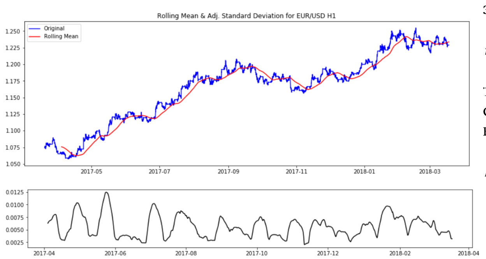
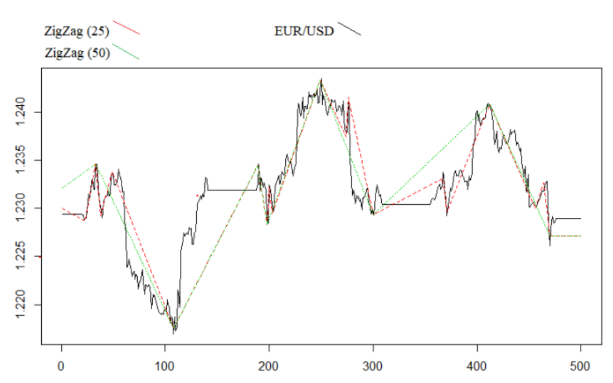
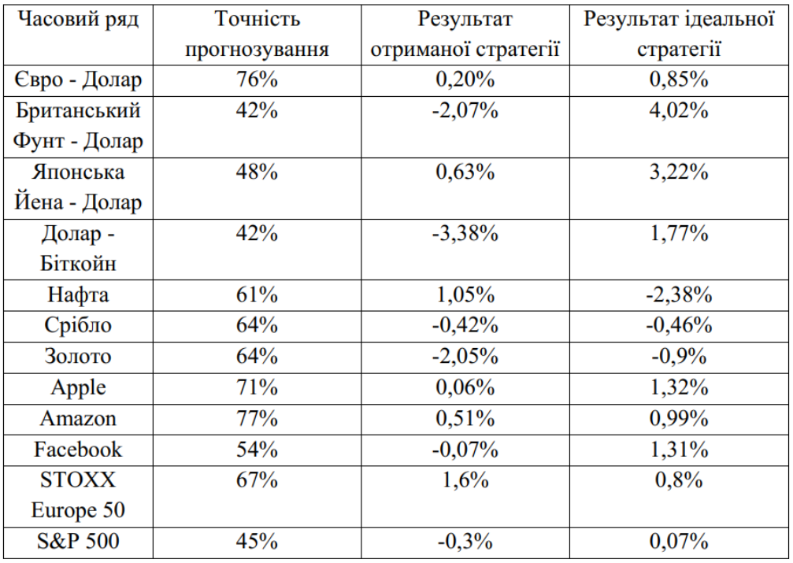

# iasa-diploma_project
My diploma project. Using Autoencoders to forecast financial time series of different nature.

The project is written in R using deepnet library.

Timeseres used:
- EUR/USD
- GBP/USD
- JPY/USD
- BTC/USD
- Brent Oil/USD
- XAU/USD
- XAG/USD
- Apple stocks
- Amazon stocks
- Facebook stocks
- STOXX Europe 50
- S&P500

Year -2018
